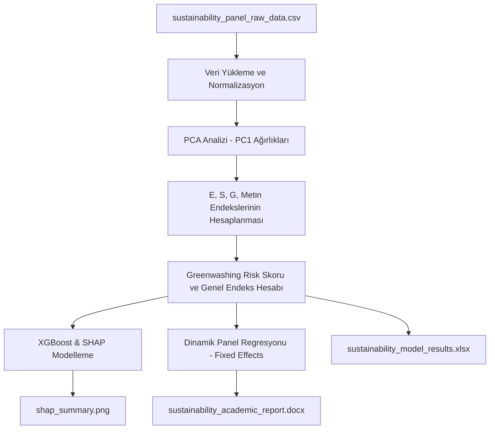

# 🌱 ESGT-analysis: Sürdürülebilirlik & Greenwashing Modelleme Projesi

Bu proje; şirketlerin sürdürülebilirlik raporlarından elde edilen çevresel, sosyal, yönetişim (ESG) ve metinsel (Text) göstergeleri analiz etmek, PCA tabanlı ağırlıklandırma yöntemiyle endeksler türetmek, Greenwashing Risk Skorunu XGBoost + SHAP yöntemleriyle açıklamak ve dinamik panel regresyon modelleriyle davranışsal tutarlılığı tahmin etmek üzere tasarlanmış akademik ve pratik bir analiz aracıdır.

---

## 📌 Proje Akış Diyagramı



---

## 🧠 Modellenen Değişkenler ve Endeks Yapısı

Proje kapsamında kullanılan değişken sözlüğü ve endeks bileşenleri aşağıda özetlenmiştir:

| Endeks / Skor | Bileşenler | Normalizasyon Mantığı |
| :--- | :--- | :--- |
| **ENVIndex (Çevresel)** | Scope 1-2-3 Emisyonları, Enerji/Su Tüketimi, Atık Miktarı, Net-Zero ve Emisyon Azaltım Hedefleri | `lower_better` (emisyon ve tüketimler için), `higher_better` (yenilenebilir oranı), `binary` (hedefler) |
| **SOCIndex (Sosyal)** | Kadın çalışan oranı, çalışan başına eğitim saati, iş kazası oranı | `higher_better` (kadın çalışan, eğitim), `lower_better` (kazalar) |
| **GOVIndex (Yönetişim)** | Yönetim kurulu bağımsızlığı, kadın üye oranı, ESG komitesi, etik politikalar | `higher_better` (bağımsızlık, kadın üye), `binary` (politika ve komiteler) |
| **TEXTIndex (Metin)** | GRI/TCFD uyum skorları, belirsiz ifade oranı, sayısal kanıt oranı, kanıt destekli iddia oranı, olumlu duygu skoru | `already_0_100` (GRI/TCFD), `lower_better` (belirsiz dil), `mid_better` (dengeli duygu dili) |

### 1. Temel Bileşenler Analizi (PCA) ile Ağırlıklandırma
Her boyut (E, S, G, Text) için normalize edilmiş göstergeler üzerinde PCA uygulanarak birinci temel bileşene (PC1) ait yük değerleri elde edilir. Bu değerler normalize edilerek ilgili endeksi oluşturan katsayılar (ağırlıklar) hesaplanır:
$$Index = \sum w_i \times Var_{i, \text{norm}}$$

### 2. Greenwashing Risk Skoru (GRS) Formulü
Metinsel iddiaların kalitesine ve standart uyumlarına bağlı olarak türetilen bağımlı değişkendir:
$$\text{GRS} = 0.25 \times (100 - \text{Clarity}) + 0.25 \times (100 - \text{QuantEvidence}) + 0.25 \times (100 - \text{EvidenceBacked}) + 0.125 \times (100 - \text{GRINorm}) + 0.125 \times (100 - \text{TCFDNorm})$$

---

## 🚀 Kurulum ve Çalıştırma

### 1. Gereksinimlerin Yüklenmesi
Projenin çalışması için Python 3.8+ ve aşağıdaki kütüphaneler gereklidir. Terminal veya PowerShell üzerinden kurulum yapabilirsiniz:

```bash
pip install pandas numpy scikit-learn xgboost shap linearmodels python-docx openpyxl matplotlib seaborn
```

### 2. Projenin Çalıştırılması
Analiz boru hattını (pipeline) başlatmak için klasör dizinindeyken aşağıdaki komutu yürütünüz:

```bash
python sustainability_analysis.py
```

---

## 🛠️ Verileri Değiştirme ve Özelleştirme

Proje, yeni veya değiştirilmiş verilerle dinamik olarak çalışacak şekilde yapılandırılmıştır.

1. **Varsayılan Davranış**: Klasörde `sustainability_panel_raw_data.csv` dosyası yoksa, sistem otomatik olarak 20 şirket ve 5 yılı (2020-2024) kapsayan gerçekçi sentetik bir panel veri seti oluşturur.
2. **Kendi Verilerinizle Çalışma**:
   * İlk çalıştırma sonrası oluşan `sustainability_panel_raw_data.csv` dosyasını Excel veya bir metin düzenleyiciyle açarak verileri değiştirebilirsiniz.
   * Kendi şirket verilerinizi aynı sütun yapısında ve isimleriyle bu dosyaya aktarabilirsiniz.
   * Betiği tekrar çalıştırdığınızda, sistem otomatik olarak bu CSV dosyasını okuyacak ve tüm PCA, XGBoost + SHAP ve Dinamik Panel analizlerini yeni verilerinize göre güncelleyecektir.

---

## 📈 Çıktı Dosyaları ve Yapısı

Analiz tamamlandığında dizinde şu dosyalar oluşacaktır:

* **`sustainability_model_results.xlsx`**: Tüm ham veriler, normalizasyonlar, PCA katsayıları, hesaplanan endeksler, tanımlayıcı istatistikler ve regresyon katsayılarını içeren çok sayfalı Excel tablosu.
* **`sustainability_academic_report.docx`**: Tabloları biçimlendirilmiş, grafik ekleri gömülü ve APA-7 standartlarına uygun akademik araştırma raporu.
* **`shap_summary.png`**: XGBoost modeli kararlarını etkileyen faktörlerin SHAP Summary grafiği.
* **`correlation_matrix.png`**: Endeksler ve değişkenler arası ilişki matrisi.
* **`index_trends.png`**: Yıllara göre çevresel, sosyal, yönetişim ve metinsel kalitenin değişim çizgileri.

---

## 🧑‍💻 Örnek Kod Parçaları

### PCA Ağırlık Hesabı
```python
pca = PCA(n_components=1)
pca.fit(scaled_data)
loadings = pca.components_[0]
# Yön düzeltmesi ve normalizasyon
weights = np.abs(loadings) / np.sum(np.abs(loadings))
```

### Dinamik Panel Veri Modeli
```python
# Fixed Effects LSDV modeli
fe_model = PanelOLS(
    panel_clean.Greenwashing_Risk_Score,
    panel_clean[['const', 'L1_Greenwashing_Risk_Score', 'ENVIndex', 'SOCIndex', 'GOVIndex', 'TEXTIndex', 'firm_size_log_assets', 'roa', 'leverage']],
    entity_effects=True,
    time_effects=True
)
fe_res = fe_model.fit(cov_type='clustered', cluster_entity=True)
```
